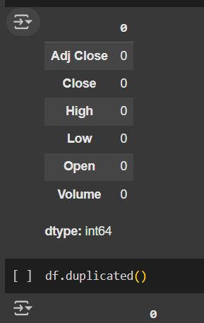
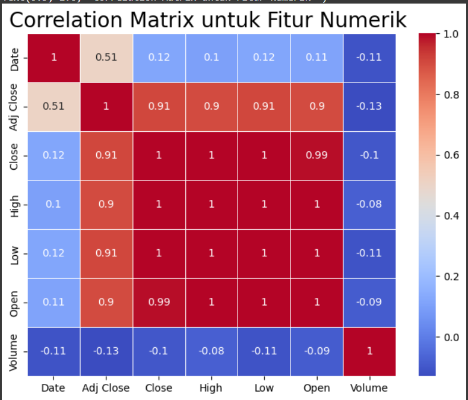
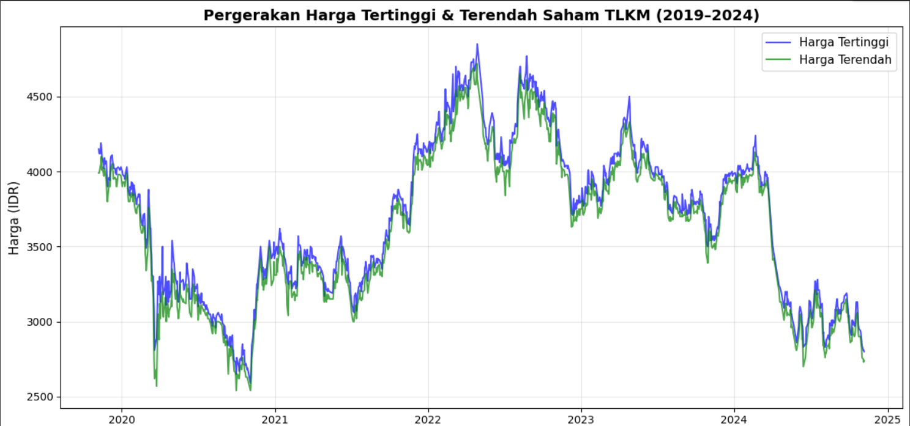
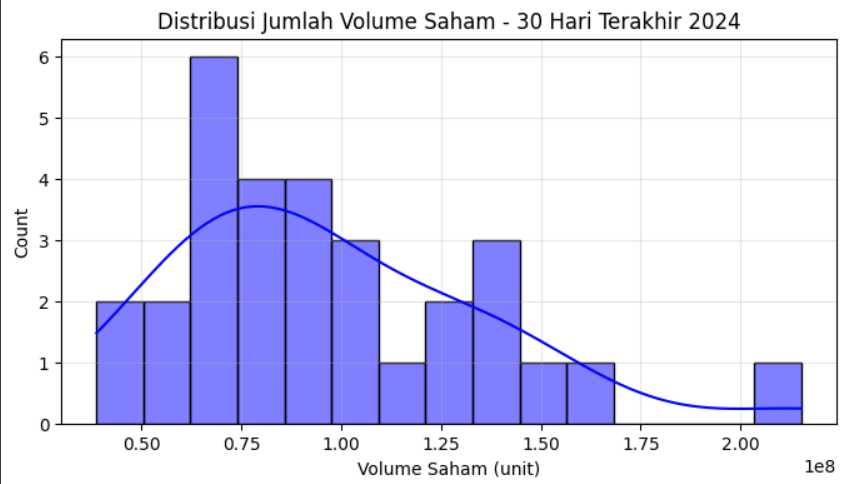
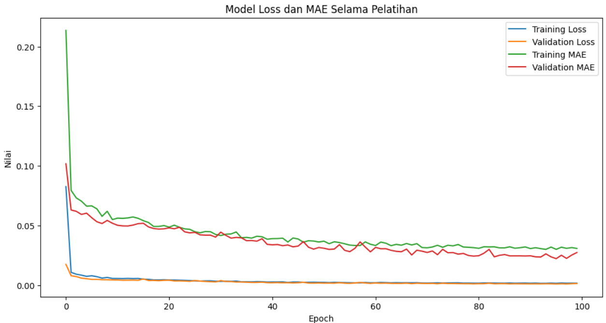

# Laporan Proyek Machine Learning - Nadila Agustiani Farhan

## Domain Proyek

### Latar Belakang


Investasi saham menjadi salah satu pilihan populer untuk memperoleh keuntungan jangka panjang. Saham merupakan surat berharga yang mencerminkan kepemilikan atas suatu perusahaan [4]. Meskipun berpotensi menghasilkan keuntungan, fluktuasi harga saham membuat investasi ini mengandung risiko [2].
PT Telkom Indonesia (Persero) Tbk (TLKM) adalah salah satu emiten unggulan yang termasuk kategori blue chip karena fundamentalnya kuat dan kapitalisasi pasarnya besar [1]. Perusahaan ini merupakan BUMN di bidang layanan TIK, dengan mayoritas saham (52.09%) dimiliki oleh pemerintah [3].
Namun, data historis menunjukkan bahwa harga saham TLKM tidak stabil. Menurut riset H. Nazhiroh (2022), harga saham TLKM sempat turun drastis hingga Rp2.256 per lembar pada 2020, lalu naik signifikan hingga Rp4.770 pada Agustus 2022 [6]. Hal ini diperkuat oleh riset Isna Alima (2024) yang menunjukkan tren naik sejak September 2020 hingga Februari 2023, namun dengan volatilitas tinggi; nilai tertinggi Rp4.680 dan terendah Rp2.620 [5]. Kedua riset tersebut menunjukkan bahwa data saham TLKM bersifat tidak stasioner, baik dari sisi rata-rata maupun variansnya.
Kondisi ini menuntut penggunaan metode prediksi yang mampu menangani pola data non-linier dan fluktuatif. Salah satu metode yang terbukti efektif adalah Long Short-Term Memory (LSTM), yang dirancang untuk mengenali pola jangka panjang dalam data time series. Model ini diharapkan dapat membantu investor dalam mengambil keputusan transaksi saham secara lebih akurat dan berbasis data.

## Business Understanding
Volatilitas harga saham TLKM yang tinggi menunjukkan perlunya strategi pengambilan keputusan investasi yang berbasis data. Investor membutuhkan alat bantu prediktif untuk mengidentifikasi waktu terbaik membeli atau menjual saham guna memaksimalkan keuntungan dan meminimalkan risiko.
Proyek ini bertujuan membangun model prediksi harga saham PT Telkom Indonesia menggunakan algoritma Long Short-Term Memory (LSTM). Dengan memanfaatkan data historis saham TLKM, model ini diharapkan mampu menangkap pola jangka panjang dan memberikan prediksi harga saham yang lebih akurat dibandingkan pendekatan tradisional.
Hasil dari model ini akan membantu investor, analis pasar, dan pengambil keputusan dalam menyusun strategi investasi yang lebih tepat dan adaptif terhadap perubahan pasar.

### Problem Statements

Berdasarkan latar belakang tersebut, masalah yang berusaha diatasi melalui model ini diantaranya:
- Bagaimana trend harga dalam rentang waktu 2019 hingga 2024?
- Bagaimana harga saham mempengaruhi jumlah saham yang diperdagangkan?
- Bagaimana data historis mampu memprediksi harga di masa depan?

### Goals
Tujuan dari proyek analisis prediktif diantaranya: 

- Menganalisis pergerakan harga saham TLKM dari tahun 2019 hingga 2024 guna mengidentifikasi pola historis, tren jangka panjang, dan anomali yang mungkin terjadi.
- Menganalisis hubungan antara harga saham dan volume perdagangan untuk memahami dinamika pasar dan perilaku investor.
- Menghasilkan prediksi harga saham untuk beberapa waktu ke depan (next-day forecasting) menggunakan model LSTM berbasis time series.

### Solution statements
Untuk mencapai tujuan dalam memprediksi harga saham secara akurat, beberapa solusi teknis yang diterapkan antara lain:
- Melakukan standarisasi/normalisasi data dengan menggunakan MinMaxScaler pada fitur agar model dapat belajar dengan lebih stabil terutama untuk model LSTM. 
- Membangun model prediksi harga saham menggunakan Long Short-Term Memory (LSTM)
- Evaluasi performa model dengan mengukur performanya berdasarkan metrik RMSE, MAE, dan R² untuk membandingkan efektivitas model.

## Data Understanding
Data yang digunakan mengambil data Harga Saham PT Telekomunikasi Indonesia (tbk) yang bersumber dari Kaggle
Link dataset: [Kaggle](https://www.kaggle.com/datasets/irfansaputranst/dataset-saham-tlkm-jk)
- Menganalisis informasi data
```sh
  df.info
 ```
Didapat informasi sebagai berikut

```sh 
RangeIndex: 1212 entries, 0 to 1211
Data columns (total 7 columns):
 #   Column     Non-Null Count  Dtype  
---  ------     --------------  -----  
 0   Date       1212 non-null   object 
 1   Adj Close  1212 non-null   float64
 2   Close      1212 non-null   float64
 3   High       1212 non-null   float64
 4   Low        1212 non-null   float64
 5   Open       1212 non-null   float64
 6   Volume     1212 non-null   object 
dtypes: float64(5), object(2)
memory usage: 66.4+ KB
```
### Fitur-fitur utama
- Date      : Tanggal pencatatan data dalam format DD/MM/YYYY.
- Open      : Harga pembukaan saham.
- High      : Harga tertinggi harian.
- Low       : Harga terendah harian.
- Close     : Harga penutupan harian.
- Adj Close : Harga penutupan yang telah disesuaikan.
- Volume    : Jumlah saham yang diperdagangkan.

### Cleaning Data
- Mengubah tipe data kolom Date dan Volume, menjadikan Date sebagai index
```sh
# Mengubah kolom 'Date' ke format datetime (DD/MM/YYYY)
df['Date'] = pd.to_datetime(df['Date'], format='%d/%m/%Y')
df.set_index('Date', inplace=True)

# Mengubah kolom 'Volume' ke float dan menghilangkan titik pemisah ribuan terlebih dahulu
df['Volume'] = df['Volume'].str.replace('.', '', regex=False).astype(float)
Menangani missing values dan duplicated data
```
- Menangani missing value dan duplicated
Setelah diperiksa, data bersih dari missing value ataupun duplkasi data. 


- Menangani outlier
Terdapat outlier pada kolom Volume. Sehingga menggunakan metode IQR untuk mengatasinya.
```sh
#Menghitung Q1, Q3, dan IQR hanya untuk kolom Volume
Q1 = df['Volume'].quantile(0.25)
Q3 = df['Volume'].quantile(0.75)
IQR = Q3 - Q1

filter_outliers = ~((df['Volume'] < (Q1 - 1.5 * IQR)) |
                    (df['Volume'] > (Q3 + 1.5 * IQR)))

df = df[filter_outliers]
# Cek ukuran dataset setelah outlier dihapus
df.shape
# Memeriksa ulang outlier
sns.boxplot(x=df['Volume'])
```
### Eksploratory Data Analysis (EDA)

### **Memeriksa korelasi antar fitur menggunakan heatmap**.


- Korelasi antara Adj Close, Close, Open, High, Low sangat tinggi (0.90 – 1.00). Hal ini menunjukan bahwa harga-harga saham ini berjalan sangat selaras, karena: Harga buka, tutup, tertinggi, dan terendah harian biasanya berbeda tipis. Close dan Adj Close hampir identik, perbedaannya terletak pada penyesuaian dividen/split
- Korelasi volume dengan semua kolom sangat rendah dan negatif (-0.08 s/d -0.13) Hal ini menunjukan bahwa Volume tidak punya hubungan linier kuat dengan harga.

### **Melakukan visualisasi tren harga saham dari waktu ke waktu**.


- Perbedaan antara garis biru (harga tertinggi) dan garis hijau (harga terendah) mencerminkan volatilitas harian, yaitu tingkat fluktuasi harga dalam satu hari. Semakin besar jaraknya, semakin tinggi tingkat volatilitas harian saham.
- Harga saham menunjukkan tren kenaikan yang konsisten dari pertengahan 2021 hingga mencapai puncaknya pada pertengahan 2022.
- Harga tertinggi dan harga terendah cenderung bergerak seiring, yang menunjukkan tidak terdapat anomali ekstrem atau pergerakan harga yang tidak wajar selama periode tersebut.
 
### Melihat distribusi volume dalam 30 hari terakhir


## Data Preparation
1. **Normalisasi Data:**
Menggunakan MinMaxScaler untuk menstandarkan nilai pada kolom Close, agar model LSTM dapat belajar secara stabil tanpa terpengaruh perbedaan skala antar fitur.

3. **Spliting data:**
Membagi data menjadi 80% untuk data latih dan 20% pada data uji berdasarkan urutan waktu (tanpa pengacakan), untuk mempertahankan sifat time series.

5. **Pembuatan Data Time Series:**
Untuk mempersiapkan data yang sesuai dengan kebutuhan model LSTM, dilakukan proses transformasi dataset menjadi bentuk urutan (sequence) berdasarkan jendela waktu (time window). Model LSTM membutuhkan input dengan struktur tiga dimensi: (jumlah sampel, panjang urutan waktu, jumlah fitur), sehingga data perlu direstrukturisasi terlebih dahulu.

## Modeling
Dalam pengembangan model untuk memprediksi harga saham PT Telekomunikasi Indonesia, digunakan pendekatan deep learning dengan algoritma Long Short-Term Memory (LSTM). LSTM dipilih karena memiliki kemampuan dalam mengingat informasi jangka panjang dan menangani ketergantungan waktu (temporal dependencies) yang umum dijumpai pada data time series, seperti harga saham.

**Algoritma Utama: Long Short-Term Memory (LSTM)**
Model LSTM memiliki struktur memori internal yang memungkinkan jaringan untuk mempertahankan informasi penting dari urutan data sebelumnya. Hal ini menjadikan LSTM sangat efektif dalam menangkap pola historis dan tren jangka panjang dalam data harga saham.

**Arsitektur Model**
- Model LSTM yang digunakan terdiri dari beberapa komponen utama berikut:
- Beberapa layer LSTM bertingkat: Untuk menangkap pola temporal secara mendalam dari data historis saham.
- Layer Dropout: Digunakan untuk mencegah overfitting dengan mengabaikan sejumlah unit secara acak selama pelatihan.
- Layer Dense (Fully Connected): Sebagai layer output yang menghasilkan prediksi harga saham pada waktu berikutnya.

**Parameter Model**
- Optimizer: adam — algoritma optimasi yang efisien dan adaptif untuk training neural network.
- Loss Function: mean_squared_error — digunakan untuk menghitung seberapa jauh hasil prediksi dari nilai sebenarnya.
- Epoch: 100 — jumlah iterasi pelatihan model terhadap seluruh dataset.
- Batch Size: 32 — jumlah sampel yang diproses sebelum model diperbarui.
  
**Visualisasi Hasil Training dan Validasi**


- Model berhasil belajar dengan baik dan mampu melakukan generalisasi dengan baik terhadap data baru.
- Tidak ada indikasi kuat terjadinya overfitting. hal tersebut terlihat dari gap antara training loss dan validation loss yang tidak terlalu besar.
- Baik nilai loss maupun MAE menunjukkan konvergensi yang stabil, menandakan bahwa jumlah epoch (100) dan parameter pelatihan lainnya sudah cukup baik.
- 
## Evaluation

Evaluasi performa model dilakukan menggunakan beberapa metrik regresi, yaitu **Mean Squared Error (MSE)**, **Root Mean Squared Error (RMSE)**, **Mean Absolute Error (MAE)**, **Mean Absolute Percentage Error (MAPE)**, dan **R² Score** (coefficient of determination). Hasil evaluasi model pada data uji adalah sebagai berikut:

|  Metrik    |	Nilai	    |  Interpretasi Singkat|
| ---------- | ---------- | -------------------- |
|  MSE	     | 5832.5618  |	Rata-rata kuadrat error; semakin kecil, semakin baik.|
|  RMSE	     | 76.3712    |	Akar dari MSE; lebih mudah dipahami karena satuannya sama dengan data asli.|
|  MAE	     | 55.8816    |	Rata-rata absolut selisih prediksi dan nilai aktual.|
|  MAPE	     | 2.10%      |	Rata-rata persentase error; menunjukkan model cukup akurat. |
|  R² Score  | 0.9685     |	Model menjelaskan 96.85% variasi data aktual; mendekati 1, berarti sangat baik. |

Dengan **R² = 0.9685**, model LSTM terbukti mampu memodelkan pola historis harga saham PT Telekomunikasi Indonesia dengan sangat baik. Nilai MAPE yang rendah (2.10%) juga mengindikasikan bahwa rata-rata kesalahan prediksi relatif kecil dibandingkan nilai aktualnya.

## Kesimpulan

Berdasarkan proyek prediksi harga saham PT Telkom Indonesia (TLKM) menggunakan model Long Short-Term Memory (LSTM), diperoleh beberapa kesimpulan penting:
1. **Analisis Pergerakan Harga Saham TLKM (2019–2024)**


Dari hasil visualisasi data historis, terlihat bahwa harga saham TLKM mengalami fluktuasi yang signifikan selama periode 2019 hingga 2024. Terdapat tren penurunan pada awal periode pandemi, disusul dengan tren kenaikan harga yang cukup stabil hingga pertengahan 2022. Tren ini menunjukkan bahwa pergerakan harga saham sangat dipengaruhi oleh kondisi makroekonomi dan sentimen pasar.

2. **Korelasi antara Harga Saham dan Volume Perdagangan**
Analisis korelasi antara volume perdagangan dengan harga saham (Open, High, Low, Close) menunjukkan nilai korelasi yang kecil dan negatif. Hal ini mengindikasikan bahwa volume perdagangan tidak memiliki hubungan yang kuat terhadap pergerakan harga saham TLKM. Dengan kata lain, tingginya volume transaksi tidak serta merta memengaruhi naik-turunnya harga saham, sehingga investor perlu mempertimbangkan faktor lain dalam pengambilan keputusan investasi.

3. **Prediksi Harga Saham Menggunakan LSTM**


Model LSTM berhasil mempelajari pola historis harga saham TLKM dan menunjukkan performa prediksi yang sangat baik. Hal ini terlihat dari grafik perbandingan antara harga aktual dan hasil prediksi, di mana garis prediksi mengikuti dengan akurat tren harga aktual. Hasil ini memperkuat keandalan LSTM dalam menangani data time series dan memberikan nilai prediktif yang tinggi, sehingga dapat menjadi alat bantu yang efektif bagi investor dalam mengambil keputusan transaksi.

## Referensi
[1] Hendra T et al., "Prediksi Harga Saham Telkom Menggunakan Prophet: AnalisisPengaruh Sentimen Publik Terhadap Kehadiran Starlink," Malcom Jurnal, 2025. [Link](https://journal.irpi.or.id/index.php/malcom/article/view/1796/927)

[2] Meydina Rhma, "Implementasi Algoritma Long Short Term Memory(LSTM) untuk Prediksi Penutupan Harga Saham PT Telkom Indonesia," Medium.com, 2021. [Link](https://meydina-rhma.medium.com/implementasi-algoritma-long-short-term-memory-lstm-untuk-prediksi-penutupan-harga-saham-pt-telkom-1d3997ddb81c)

[3] Telkom Indonesia., "Sekilas tentang Telkom Indonesia"., telkom.co.id, [Link]((https://www.telkom.co.id/sites/profil-telkom/id_ID/page/profil-dan-riwayat-singkat-22))

[4] W.R. Ulul Fadilah, “Analisis Prediksi Harga Saham PT. Telekomunikasi Indonesia Menggunakan Metode Support Vector Machine,” ResearchGate, 2020. [Link](https://www.researchgate.net/publication/347653454_Analisis_Prediksi_Harga_Saham_PT_Telekomunikasi_Indonesia_Menggunakan_Metode_Support_Vector_Machine)

[5] Isna Alima, “Prediksi Harga Saham PT.Telekomunikasi Indonesia Menggunakan Metode Transformasi Wavelet Diskrit Daubechies,” Jurnal Statkom, 2023. [Link](https://journal.unugiri.ac.id/index.php/statkom/article/view/2981/1441)

[6] H. Nazhiroh et al., "PT.Telkom (Tbk) Stock Price Forecasting Using Long Short Term Memory (LSTM)., UNP jurnal, 2022 [Link](https://ujsds.ppj.unp.ac.id/index.php/ujsds/article/download/223/144/2987)  

